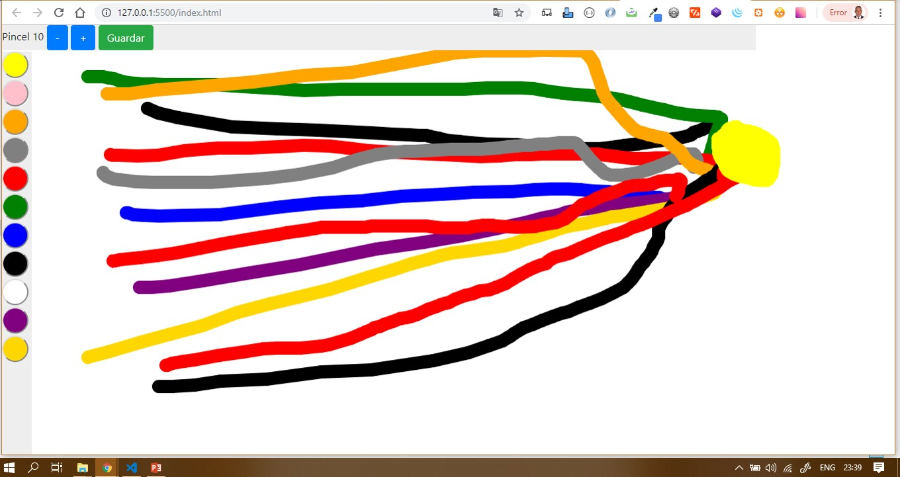

# Pizarra Paint JPV 
# Programa en HTML, CSS, Javascript, Bootstrap, y Canvas, para dibujar en el navegador, seleccionando
# colores y tamaños a tu gusto, se hace uso de div, clases, y selectores basicos, asi como variables
# y funciones, for y arreglos, para sus funcionalidades.

La aplicación tiene Cuatro oyentes de eventos:

1-Un detector de eventos de ventana para activar la función de cambio de tamaño cuando se cambia el tamaño de la ventana
un detector de eventos de documentos para activar la función draw () cuando se mueve el mouse y el touch

2-Un detector de eventos de documentos para activar la función setPosition () (posición actual del mouse del usuario) cuando se hace clic con el mouse y el touch

3-Un detector de eventos de documentos para activar la función setPosition () (posición actual del mouse del usuario) cuando el mouse y touch se mueve sobre la función de lienzo

4-Un detector de eventos de documentos para activar la función setPosition () (posición actual del touch del Dispositivo) cuando el touch se mueve sobre la función de lienzo.

# De manera similar, también le demos a nuestro usuario varios tamaños que van desde el tamaño 2, hasta el 30, para dibujar, Para recapitular nuestra aplicación debe tener lo siguiente:

1- Herramientas: colores, botones, guardar.

2- Colores para elegir (incluyendo blanco pra borrador)

3- Tamaños para elegir

